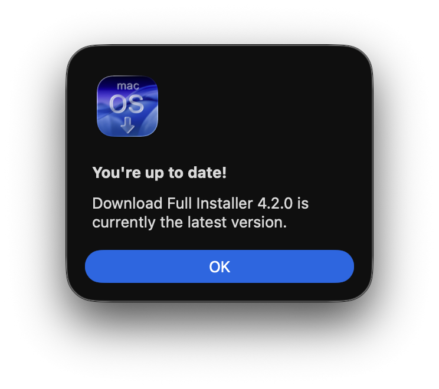
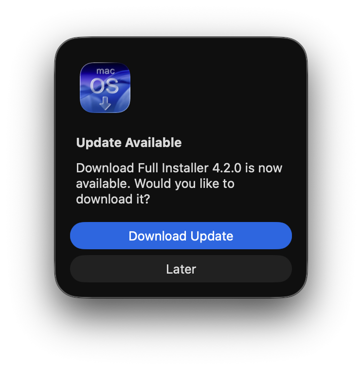

# GitHub Updater System

<a href="README-es.md">
    </a><br>

## Overview

A lightweight, integrated update checker designed for SwiftUI applications published on GitHub, which queries the GitHub versioning API to detect newer versions of the application. It requires no third-party dependencies (no Sparkle or similar framework required).

| Up-to-date | Update available |
| --- | --- |
|  |  |

## Comparison with Sparkle

Sparkle is a widely used framework for updating applications when new versions are available. It has been known to macOS users for many years. Free and open-source, it has the right functionality for its intended purpose. Tested by many thousands of users.

However, it has one drawback: configuring it in Swift applications that run in sandboxed mode. In theory, its configuration is simple, but in practice, getting notifications, downloads, and installations of new versions to work as they should can be a nightmare. Sometimes, even after following the instructions to the letter, testing and verifying everything more than once, the update process still fails. Finding the cause of the failure is not always easy.

[Here](https://github.com/perez987/How-to-Sparkle-in-Xcode-project) are detailed instructions for configuring Sparkle in an Xcode Swift project. There are many other places to consult, including the Sparkle documentation.

GitHub's Update System, on the other hand, stands out for its simplicity and the ease with which you can configure notifications for new updates. Whether the application is sandboxed or not is irrelevant. All that's needed is a Swift file and a few lines of code in the application's file. Security is maintained with much less complexity, as the user is taken to the official page for the new version, and no data is saved between runs.

## How to Check for Updates

Open the **About This Application** menu and click **Check for Updates…** (or press `⌘ U`). The Application contacts GitHub and, depending on the result, shows one of the alerts described below.

The same check is available programmatically for automatic background checks on launch.

## Alert Types

| Situation | Title | Message |
|-----------|-------|---------|
| A newer version is available | *Update Available* | "Application X.X.X is now available. Would you like to download it?" |
| Already on the latest version (user-initiated only) | *You're up to date!* | "Application X.X.X is currently the latest version." |
| Network error | *Update Check Failed* | "Unable to connect to the update server. Please check your internet connection." |
| API / parsing error | *Update Check Failed* | "Failed to retrieve update information." |

When an update is available, clicking **Download Update** opens the releases page in the default browser. Clicking **Later** dismisses the alert without any action.

## Version Routing Logic

The checker adapts its GitHub API call based on the major version number of the running Application.

- API endpoint used `/repos/.../releases/latest`
- Uses the standard *latest release* endpoint. 

This routing ensures that users always track the global latest release.

## Version Comparison

Versions are compared component-by-component after stripping a leading `v` from the tag name (e.g., `v3.0.2` → `3.0.2`). Missing components are treated as `0`, so `3.1` is equal to `3.1.0`.

## Technical Details

The updater is implemented as a singleton in `GitHubUpdateChecker.swift`:

```swift
GitHubUpdateChecker.shared.checkForUpdates(userInitiated: true)
```

Pass `userInitiated: true` when the user explicitly triggers the check (shows the *up-to-date* alert). Pass `userInitiated: false` for automatic background checks (the *up-to-date* alert is suppressed to avoid interrupting the user).

### HTTP Request

```
GET https://api.github.com/repos/GHuser/GHrepo/releases/latest
Accept: application/vnd.github+json
X-GitHub-Api-Version: 2022-11-28
```

### No Persistent State

The checker does not store any state between runs. Every check is a fresh HTTP request and version comparison. No version numbers or timestamps are written to disk.

## Localization

All user-facing strings are fully localized through `Localizable.strings`. The relevant keys are:

| Key | Default (English) |
|-----|-------------------|
| `Check for Updates…` | Check for Updates… |
| `UpdateAvailable` | Update Available |
| `UpdateAvailableInfo` | Application %@ is now available. Would you like to download it? |
| `DownloadUpdate` | Download Update |
| `UpdateLater` | Later |
| `UpToDate` | You're up to date! |
| `UpToDateInfo` | Application %@ is currently the latest version. |
| `UpdateCheckError` | Update Check Failed |
| `UpdateCheckFailed` | Failed to retrieve update information. |
| `UpdateCheckNetworkError` | Unable to connect to the update server. Please check your internet connection. |

## Implementation

### GitHubUpdateChecker.swift

This is the only required code file. It's a Singleton pattern that guarantees a single instance of a class will exist throughout the application's execution, providing a global access point. It must be added to the Xcode project.

You need to check these two properties, replacing them with the owner's name and the name of the GitHub repository:

```swift
    private let owner = "GH-owner"
    private let repo = "GitHub-repo"
```

The rest of the file can be used as is. You can view the contents of this file in [Files/Updater/GitHubUpdateChecker.swift](Files/Updater/GitHubUpdateChecker.swift)

### Language files

The strings used in the update process are localized and translated into 5 languages: English, Spanish, French, German, and Italian. They are available in `Files/Resources`.

### Info.plist

It's not required, but it is recommended to have the `BundleShortVersionString` and `BundleVersion` properties in the Info.plist file not hardcoded, but read from the project configuration:

```xml
<key>CFBundleShortVersionString</key>
<string>$(MARKETING_VERSION)</string>
<key>CFBundleVersion</key>
<string>$(CURRENT_PROJECT_VERSION)</string>
```

### Command menu

The menu that checks for updates is easy to implement. A menu button with four components is added to the application file, just after `.appinfo` ("About This Application"):

- String "Check for Updates"
- Image "arrow.triangle.2.circlepath"
- Link to `checkForUpdates` function
- Keyboard shortcut (`⌘ + U`).

```swift
        .commands {
            CommandGroup(after: .appInfo) {
                // Settings to check for updates
                Button(NSLocalizedString("Check for Updates…", comment: "Menu item to check for app updates"),
                       systemImage: "arrow.triangle.2.circlepath") {
                    GitHubUpdateChecker.shared.checkForUpdates(userInitiated: true)
                }
                       .keyboardShortcut("u", modifiers: [.command])
            }            
        }
```

